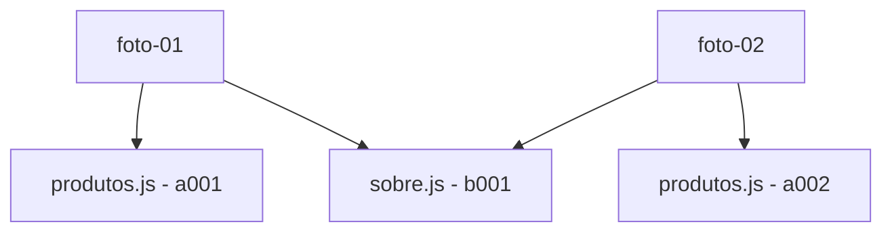

# Dia 5 - Controle de Versionamento (Parte 1/2)

- **Objetivo do Dia:** Entender como trabalhar com o Git offline.
- **Dia 6:** Entender como trabalhar com o Git online.

Note: Caso esteja usando o Codespaces, você sempre precisará de acesso à internet, pois o Codespaces é uma máquina virtual que roda na nuvem, e, portanto, não possui acesso à internet.

## Resumão: Comandos abordados no dia 5

| Comando | Descrição |
| --- | --- |
| `git log` | lista os `commits` do repositório |
| `git add` | adiciona arquivos ao `staging area` |
| `git commit` | cria um `commit` |
| `git commit --amend` | altera o último `commit` |
| `git diff` | mostra as diferenças entre arquivos, em relação ao `staging area` |
| `git diff --cached` (BONUS) | mostra as diferenças entre arquivos, em relação ao `commit` |
| `git status` (BONUS) | mostra o status dos arquivos |

## Como funciona o Git

Antes do Git, era comum que os programadores apenas tivessem acesso a o histórico do `Ctrl+Z`, o que era completamente ineficiente e limitava muito a produtividade.

Posteriormente, pessoas começaram a duplicar as pastas de projetos, o que, por mais que permita que salvemos diversas versões de um projeto, ocupa muita memória e não é uma boa prática. Isso sem nem adicionar o fato de que era um inferno completo para colaborar com outras pessoas - você teria que isolar todos arquivos que a pessoa modificou e atualizar na sua base local e ela faria o mesmo para todos arquivos que você modificou. Sem nem falar sobre fazer isso com mais de 2 pessoas...

Para resolver isso, criamos o conceito de Versionamento de Código

## Versionamento de código: uma timeline rápida

1. Bell Labs (1972) - SCCS (Source Code Control System) **Centralizado**
2. University of California, Berkeley (1982) - RCS (Revision Control System) **Centralizado**
3. CVS Team (1986) - CVS (Concurrent Versioning System) **Centralizado**
4. Apache Software Foundation (2000) - SVN (Subversion) **Centralizado**
5. Linus Torvalds (2005) - Git **Distribuído**

### Centralizado x Distribuído

#### Centralizado

Nos sistemas centralizados existe uma cópia principal do código em um servidor e os desenvolvedores reservam arquivos para dentro de seu computador, ficando indisponíveis para os outros colaboradores. Importante: os arquivos reservados ainda são visíveis para todos os outros desenvolvedores, mas não podem ser alterados (estão em `readonly`).

**Analogia:** é como se um repositório fosse um "hotel" e os arquivos saíssem dele, fazendo um `checkout` (termo realmente usado nesse tipo de versionamento). De forma semelhante, quando os desenvolvedores não precisam mais do arquivo, eles fazem o `checkin` dele para o hotel, se tornando disponíveis para os outros desenvolvedores (Aqui a analogia está contrária ao que pensamos normalmente em termos de quartos de hotel, mas é isso mesmo hahah).

**Problemão:** Era comum que desenvolvedores esquecessem de fazer o `checkin` de arquivos quando terminavam de usá-los e, até mesmo, sair de férias com os arquivos indisponíveis para os outros desenvolvedores.

O motivo para que os sistemas centralizados serem `bloqueantes` é evitar ao máximo a dor de cabeça de os desenvolvedores terem que fazer `merges` (ou mesclas). Um `merge` ocorre quando mais de um desenvolvedor alterou um mesmo arquivo e, portanto, na hora de atualizar a base de código oficial, devem escolher que alterações manter e que alterações descartar, podendo ser uma terceira versão diferente da versão do desenvolvedor 1 e do desenvolvedor 2.

#### Distribuído

Pensando nas dores de cabeça dos sistemas centralizados, foi criado o conceito de sistemas de versionamento distribuídos, que permitem que os desenvolvedores alterem qualquer arquivo, independente se há ou não outras pessoas mexendo naquele mesmo arquivo.

No momento de atualizar a base de dados oficial temos que fazer o `merge` de todas alterações. Quando há erros no processo de `merge` automático, temos um `merge conflict` que deve ser resolvido manualmente.

Nesse tipo de sistema, cada desenvolvedor pode fazer o `clone` de um repositório, tendo uma cópia exata e completa do código disponível para ele.

## Como funciona o Git por trás dos panos

Todas as informações de um repositório Git ficam guardadas localmente em um repositório `.git`.

### Comparando duas `imagens`

Quando queremos comparar a versão atual do código com outra versão anterior, estamos vendo suas `diffs`, daí vem o comando `git diff`, que mostra as diferenças entre arquivos, em relação ao `staging area`.

### O que o Git NÃO faz

Ele NÃO guarda somente o arquivo original e suas diferenças, de modo a adicionar as diferenças, commit a commit, até obtermos a versão final do código. Por isso, ele é um dos controles de versionamento mais velozes, principalmente em comparação com seus antecessores. 

Por exemplo, o CVS. O CVS guardava o arquivo original e uma linha do tempo de alterações, de modo a adicionar as alterações - ou os `Deltas` (o nome desta estratégia é `Delta Encoding`)- , commit a commit, até obtermos a versão final do código. Isso se torna inviável quando há muitos arquivos e o projeto começa a crescer.

### O que o Git faz

O Git tira sempre uma foto do seu projeto, pegando todos os arquivos dentro dele e adicionando um ID (identificador) neles e salvando dentro do repositório `.git`.



Onde cada conjunto arquivo+ID representa um `blob` (Binary Large Object). Note que quando alteramos um arquivo e criamos uma nova versão dele, o Git não descarta o primeiro `blob`, ele mantém este primeiro de forma imutável e cria um novo `blob` para a nova versão do arquivo. 

Mas é importante ressaltar que, se um arquivo não foi alterado, o Git não cria um novo `blob` para ele, então a nova foto do projeto terá o mesmo `blob` do arquivo que não foi alterado.

Assim, no exemplo acima, a foto 02 terá o `blob` `a002` para o arquivo `produtos.js` e o `blob` `b001` para o arquivo `sobre.js`, supondo que o arquivo `sobre.js` não foi alterado.

Na verdade, o Git armazena fotos, que apontam para uma árvore, que por sua vez aponta para os `blobs`, com um mecanismo que compacta esses arquivos.

### Vendo as fotos do meu repositório

`git log` (que significa "log" ou "registro") mostra todas as fotos do repositório, em ordem cronológica, do mais recente para o mais antigo.

Usando no meu repositório atual, temos:

```bash
☁  cursodev [Dia-5] ⚡  git log > log.txt
commit 34eb55a7ee8c3d990fa6b666930b7919be2790e5
Author: Cerne <miguelbadanycerne.20231@poli.ufrj.br>
Date:   Fri Nov 28 16:52:12 2025 -0300

    chore: sync files before chaos

(...)

commit 6d4f19ff7d88ff6e6b51523db9bf6fc866071daf
Author: Cerne <miguelbadanycerne.20231@poli.ufrj.br>
Date:   Sun Nov 23 10:57:50 2025 -0300

    first commit
```

Tive que usar o `> log.txt` para salvar o log em um arquivo e poder copiar o output completo para o markdown.

Mas para evitar muita poluição visual, é comum usarmos o comando `git log --oneline` para mostrar o log de forma mais compactada.

```bash
☁  cursodev [Dia-5] ⚡  git log --oneline > log.txt
34eb55a chore: sync files before chaos
2bca29f feat: first page
d18930f chore: adds dev script to package.json
6d6fbeb doc: Notas do dia 4
4e17a06 chore: adds gitignore
333bbb9 doc: finaliza as anotações do dia 3
059d1e1 chore: syncs the manifesto files
3de11e5 chore: adds the nvmrc file
49cb8ce doc: primeira parte do dia 3 documentada
29f2bbd doc: conclusao do dia 2
276fcd8 doc: adiciona o dia 1
6d4f19f first commit
```

A primeira parte de cada linha é o `hash` da foto, que é um identificador único para cada `commit` (nome real de cada foto que vinhamos falando até agora), enquanto o que vem depois é a mensagem do commit.

Um `hash` é um identificador único para cada foto, que é gerado automaticamente pelo Git, baseado em todos os arquivos do projeto.

### Vendo os diffs

Mesmo que o Git não armazene diretamente os diffs, ele armazena os `blobs` e as `árvores` que contêm os `blobs`, portanto, é possível ver os diffs entre commits.

Isso é vendo sob demanda, quando usamos o comando `git diff` para ver os diffs entre commits.

## Os 3 Estágios de um arquivo

| Nome | Significado |
| --- | --- |
| Modified | Indica que o arquivo foi modificado, mas ainda não foi adicionado ao `staging area` |
| Staged | Indica que o arquivo foi adicionado ao `staging area`, são os arquivos a serem considerados quando vamos fazer o `commit` |
| Committed | Os arquivos que já foram adicionados ao `staging area` e que foram feitos o `commit` |

### O que é a `staging area`?

A `staging area` é uma área que o Git usa para armazenar os arquivos que serão adicionados ao próximo `commit`. Ou seja, seguindo a nossa analogia, é como se o Git adicionasse esses arquivos à foto que ele vai tirar, como se estivessem subindo num palco, ou melhor, num "stage".

### Como vemos os arquivos de cada estágio?

Podemos ver os arquivos de cada estágio usando o comando `git status`. Usando esse comando, o Git compara tudo que tem de diferente no nosso diretório, desde o último commit. 

Os arquivos que não estão em nenhum dos 3 estágios listados acima (modified, staged, commited) ainda podem estar em um quarto estágio: `Untracked`. Esses são os arquivos que estão no nosso diretório (pasta), mas que não estão sendo acompanhados pelo Git. Para nosso repositório Git, é como se estes arquivos não existissem.

### Mantendo arquivos `invisíveis` para o Git

Alguns tipos de arquivos não devem ser acompanhados pelo Git, como arquivos de configuração, arquivos de logs, arquivos de dependências (no nosso caso, a pasta `node_modules` e `.next`), entre outros. Para isso, usamos o arquivo `.gitignore`.

Para ignorarmos uma pasta ou um arquivo no `.gitignore`, basta adicionarmos o nome da pasta ou do arquivo no arquivo `.gitignore`. Por exemplo, atualmente o `.gitignore` deste repositório contém:

```bash
node_modules
.next

```

## Git Diff e Git Amend


Quando fazemos um commit e percebemos que não modificamos tudo como deveríamos, temos duas opções: 

1. Fazer um novo commit, ignorando esse fato
2. Emendar o commit anterior, adicionando os arquivos que faltavam, ou modificando os arquivos que tinhamos "commitado"

Por exemplo, atualmente, o repositório que estamos tem o seguinte log:

```bash
☁  cursodev [Dia-5] ⚡  git log --stat --oneline >> log.txt
7e118ca chore: modifies the gitignore format
 .gitignore | 3 +--
 1 file changed, 1 insertion(+), 2 deletions(-)
34eb55a chore: sync files before chaos
 README.md | 151 +++++++-------------------------------------------------------
 1 file changed, 15 insertions(+), 136 deletions(-)
 (...)
 ```

 Onde o `commit` com id `34eb55a` modifica o README.md, mas ainda sem todas essas notas que temos atualmente. Caso eu queira sobrescrever este commit, posso usar o comando `git commit --amend`.
 
No nosso caso, no entanto, ainda há um outro complicador, o `commit` que queremos modificar não é o último, mas sim o penúltimo. Então, para podermos modificar o penúltimo `commit`, precisamos usar o comando `git rebase -i HEAD~2`, isso porque o `amend` só modifica o último `commit`.

Passo-a-passo:

1. Salvar a versão atual do README.md antes de "voltar no tempo". Temos que fazer isso, porque as alterações novas do arquivo estão como `modified`, ou seja, não estão salvas. Para salvar a versão atual do arquivo em um buffer, fazemos `git stash`.
2. Voltar a `HEAD` para o penúltimo `commit`: `git rebase -i HEAD~2`. Aqui, abrirá uma lista com os 2 últimos commits. Localize o `commit` que queremos modificar e mude a palavra `pick` para `edit`. Salve esta lista e feche o editor.
3. Aplique a versão atualizada ao `README.md`, removendo-a do `stash`: `git stash pop`.
4. Adicione-a ao `staging area`: `git add README.md`.
5. Faça o `commit` novamente: `git commit --amend`.
6. Agora, para aplicar as alterações ao repositório, usamos `git rebase --continue`.
7. Por fim, tendo reescrito a história no Git, faça o `push` para atualizar o repositório remoto: `git push origin <branch-a-ser-atualizada> --force` (No meu caso, a branch era `Dia-5`).

Note que o ID de todos os `commits` são imutáveis, logo, quando fazemos um `amend`, o ID do `commit` muda.

### O Caractere `Newline`

O caractere `Newline` é um caractere que representa uma nova linha. No Git, ele é representado por:
- String: `\n`
- ASCII: `Chr(10)`
- Hex: `0x0A`

É por conta deste caractere, que adicionamos explicitamente o `\n` no final do arquivo `.nvmrc`, para que ele fosse considerado como uma nova linha no fim do arquivo, configurando para o Git. o fim do arquivo corretamente.
